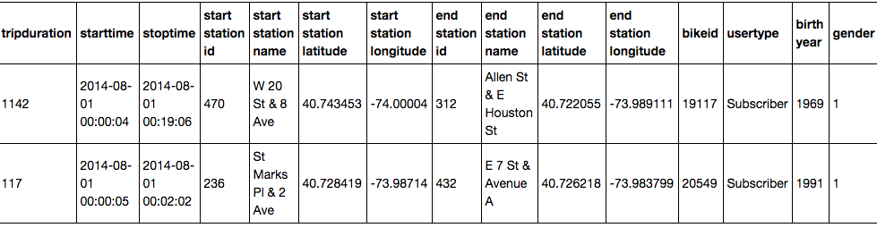
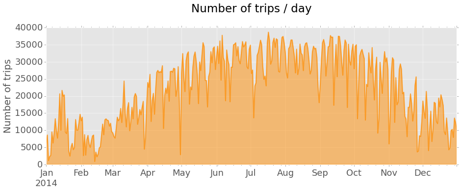
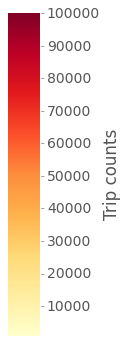
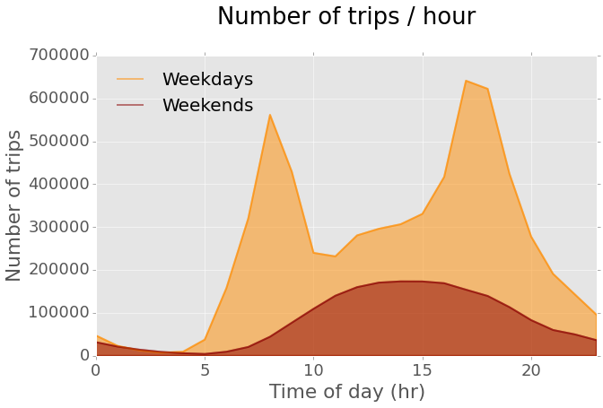
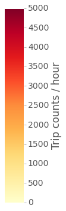

<h5> Full code on

</h5>

  

CitiBike is the public bicycle sharing system serving New York City. The service
opened in May 2013 and is currently the largest bike sharing program in the United
States. A nice thing about it is that CitiBike share their data for anyone to play
with. Here I will do just that, using Python. The final goal is to build interactive
visualizations of total trip counts and trip durations on maps of the CitiBike station
network. The following is a summarized description of the analysis, including data
manipulation (with [Pandas](http://pandas.pydata.org/)) and map visualizations (with
[Folium](http://folium.readthedocs.org/en/latest/)).

### Preparing the data

CitiBike's data can be found on their [System Data website](https://www.citibikenyc.com/system-data).
The data are organized in monthly subsets (each in its own _.csv_ file) and are available
since July 2013, soon after the CitiBike service opened. The last available month,
as of this writing, is October 2015 (last month). Using data from one whole year
seems most appropriate. It will provide a manageable amount of data and also capture
yearly patterns. For this exercise I will thus use all 2014 data, the only full year
available so far. The data have been pre-cleaned before uploading, for example by
removing trips taken by staff and any trips below 60 seconds in length. This means
they are ready to use, likely with little need for additional cleaning.

The first step is to download the 12 _.csv_ files for all months in 2014. We can
read in the file names and then use a `for loop` to load the data as 12 Pandas
data frames appended to a list.


import glob
# Get file names
filenames = glob.glob('*.csv')
import pandas as pd
# Loop through file names and read the data
dfs = []
for file in filenames:
    print('Reading ' + file)
    dfs.append(pd.read_csv(file))



Here's a screenshot showing an example of what the data look like after loading in Pandas. You can see the included variables and two observations each for the August and the September data frames.

Turns out the data are not as clean as I originally thought. The time stamps (variables
`starttime`	and `stoptime`) are formatted in one way in months up to August and in
a different way in the remaining months.	You can see examples in the screenshots above.
One way to consolidate the format is to use Pandas' `to_datetime` function to convert
the variables to the appropriate data type (Pandas uses NumPy's `datetime64`). A
little `for loop` helps save some typing. For the months from September on I need
to include information about the format, as it changes.


print('Converting month:')
for month in range(12):
    if month < 8:
        print('... ' + str(month + 1))
        dfs[month]['starttime'] = pd.to_datetime(dfs[month]['starttime'])
        dfs[month]['stoptime'] = pd.to_datetime(dfs[month]['stoptime'])
    else:
        print('... ' + str(month + 1))
        dfs[month]['starttime'] = pd.to_datetime(dfs[month]['starttime'], format = '%m/%d/%Y %H:%M:%S')
        dfs[month]['stoptime'] = pd.to_datetime(dfs[month]['stoptime'], format = '%m/%d/%Y %H:%M:%S')


Now that the timestamps are consistent, I can concatenate the datasets into one single
data frame containing all data. Finally, I can use the pickle module (part of the
Python standard library)	to save the clean Pandas data frame for future use (a
concept known as serialization). This will write a _.pkl_ file to disk that I can
save and easily read back into memory at any point in the future.


# Concatenate DataFrames
df = pd.concat(dfs)
# Pickle data
df.to_pickle('citibike_2014.pkl')


Let's move on and get more familiar with the data. There are several rather high level
questions we can quickly address to get an overview of the data. The code below shows
how to compute a few of them. The results show that our 2014 dataset includes **8,081,216**
observations of **15** variables. There were **332** CitiBike stations and **6,811**
different bikes in use.


df = pd.read_pickle('citibike_2014.pkl') # Read data
df.shape # How many observations and variables are there
df['bikeid'].unique().shape # Number of individual bikes
df['start station id'].unique().shape # Number of citibike stations


There are many ways we could go about exploring the data now. In this analysis I will
be focusing on comparing the use of the different CitiBike stations in the network,
particularly according to number of trips and trip duration. The **final goal** is
to build **visualizations of total trip counts and trip durations on maps of the
CitiBike station network**.

### Interactive map of CitiBike station use

I will start by looking at trip counts and trip durations, to get a better view of
the data. One way to look at trip counts is to plot number of trips per day over the
entire year of 2014.


import matplotlib as mpl
import matplotlib.pyplot as plt
plt.style.use('ggplot')

# Compute trip counts / day
df.index = df['starttime'] # Set 'starttime' variable as the index
countsPerDay = df.starttime.resample('D', how = ['count'])

# Plot trip counts
countsPerDay.plot(kind = 'area', stacked = False, figsize = (15, 5),
                  color = 'darkorange', linewidth = 2, legend = False)
plt.tick_params(axis = 'both', which = 'major', labelsize = 18)
plt.title('Number of trips / day\n')
plt.xlabel('')
plt.ylabel('Number of trips')


The plot shows a general trend of increasing number of trips from the Winter months
towards the Summer and a decrease thereafter, going back to harsher weather. Regular
sharp decreases in daily trip counts are also clearly seen, corresponding to weekends
and holidays.

In order to visualize trip durations I can plot an histogram of the `tripduration`
variable. The histogram reveals that most trips are rather short,	with most frequent
durations not longer than 10 minutes. Durations longer than 30 minutes are quite rare.
Here I am excluding all trips with durations longer than 1 hour, representing rare outliers.


# Collect all trips shorter than 1 hour
duration_mins = df.loc[(df.tripduration / 60 < 60)][['tripduration']]
duration_mins = duration_mins / 60 # In minutes

# Plot the distribution of trip durations
plt.rcParams.update({'font.size': 16})
duration_mins.hist(figsize = (8,5), bins = 15, alpha = 0.5, color = 'orange')
plt.tick_params(axis = 'both', which = 'major', labelsize = 18)
plt.title('Distribution of trip durations\n')
plt.xlabel('Duration (min.)')
plt.ylabel('Trip counts')


We can now work on mapping station use. I will build the map using trip start stations,
so I first need to prepare the data. The idea is to make a new data frame containing
the data need to build the interactive map. The first step is to collect the subset
of variables with information on trip start stations. I then drop duplicate station
observations, to keep only one row for each individual CitiBike station. Finally,
I can compute total trip counts out of each station, as well as mean trip duration
(using the original complete data frame). These values are stored in two new variables,
`trip count` and `mean duration`, and added to the new data frame.


# Build a table containing the stations - one observation per station
start_station = df.iloc[:,[3, 4, 5, 6]] # Keep only required variables
start_station.index = start_station['start station id'] # Index by start station id
start_station = start_station.drop_duplicates() # Keep only one row per station

# Compute trip counts and mean trip duration for each start station and add to table
count_start_station = df.groupby('start station id')['start station id'].count()
mean_start_station = df.groupby('start station id')['tripduration'].mean()
start_station['trip count'] = count_start_station
start_station['mean duration'] = mean_start_station


I can now use Folium to make the interactive map of the station network. The map will
include one marker for each station, with a color scale proportional to trip counts
out of that station and marker size proportional to mean trip duration. Folium comes
with a few _tilesets_ you can use directly. I prefer the dark _tileset_ from CartoBD,
so I will be using that instead.


import folium
from matplotlib.colors import Normalize, rgb2hex
import matplotlib.cm as cm

# Normalize trip counts
norm = Normalize(start_station['trip count'].min(), start_station['trip count'].max())
# Get dark tileset from CartoBD (https://cartodb.com/basemaps)
tileset = r'http://{s}.basemaps.cartocdn.com/dark_all/{z}/{x}/{y}.png'
# Build Folium map
start_station_map = folium.Map(location = [40.74, -73.99], width = 400, height = 600,
                               tiles = tileset,
                               attr = '© OpenStreetMap contributors, © CartoDB',
                               zoom_start = 12)
# Loop through rows (one per station) and compute marker color (trip counts) and size (trip duration)
for index, row in start_station.iterrows():
    color = rgb2hex(cm.YlOrRd(norm(row['trip count'])))
    start_station_map.circle_marker(location = [row['start station latitude'],
                                                row['start station longitude']],
                                    popup = row['start station name'], # Add labels with station name
                                    radius = row['mean duration'] / 10,
                                    fill_color = color, line_color = color)
# Create the final html document
start_station_map.create_map(path = 'start_station_map.html')


And here is the final result. The map shows markers for all stations, each clickable
to show the station name. Marker color is proportional to total trip counts (color
scale shown next to the maps) starting at the station. Marker size is proportional
to mean trip duration, from a minimum of 9.5 minutes up to a maximum of about 1 hour.

			<h4>CitiBike station use for trip start</h4>
			<h6>Color scale of trip counts Size scale of mean trip duration (9.5 min. up to 1 hour)</h6>
			<iframe style="border: 1px solid #ccc" width="402" height="602" src="../images/citibike/start_station_map.html"></iframe>
			

 

### Dynamic map of daily use of CitiBike stations

This map lumps together all trips taken in 2014 for each station. Another interesting
way to look at the data is to compute trip counts per hour and see how they change
during the average day. The following code prepares the data for that, additionally
separating weekdays and weekends, as different use of CitiBike can be expected.


# Calculate trip counts per hour on weekdays and weekends
df_sub = df.loc[:, ['tripduration', 'starttime']] # Keep only 'starttime' and 'tripduration' variables
# Index dataframe by 'datetime64' data in 'starttime' variable
df_sub.index = df_sub['starttime']
weekdays = df_sub[df_sub.index.weekday < 5]
weekends = df_sub[df_sub.index.weekday > 4]
weekdays_countsPerHr = weekdays.groupby(weekdays.index.hour).size()
weekends_countsPerHr = weekends.groupby(weekends.index.hour).size()
# Plot counts / hour on weekdays and weekends
plt.rcParams.update({'font.size': 18, 'legend.fontsize': 20})
weekdays_countsPerHr.plot(kind = 'area', stacked = False, figsize = (10, 6), color = 'darkorange',
                          linewidth = 2, label='Weekdays')

weekends_countsPerHr.plot(kind = 'area', stacked = False, color = 'darkred',
                          linewidth = 2, label='Weekends')

plt.tick_params(axis = 'both', which = 'major', labelsize = 18)
plt.title('Number of trips / hour\n')
plt.xlabel('Time of day (hr)')
plt.ylabel('Number of trips')
legend = ax.legend(loc='upper left', frameon = False)


The plot shows that there are two clear commuting peaks on weekdays. On weekends
the use pattern is different, as expected, and there are overall less trips per hour.
It would be interesting to visualize the dynamics of station use during the average
weekday. In order to do that, I can build hourly maps of station use for every hour
using weekday data and then use them to make a video illustrating the changes.
The final result, shown here below, is a dynamic visualization of how trip count
(marker color) and trip duration (marker size) change over the 24 hours on the average
weekday.

     <h4>CitiBike station use for trip start  
     on the average weekday</h4>
      <h6>Color scale of trip counts 
      Size scale of mean trip duration (2 min. up to 1 hour 45 min.)</h6>
       <iframe src="https://player.vimeo.com/video/149019949" width="250" height="400" frameborder="0" align="middle"></iframe>
       
     
 

This is it. I hope this gave you a little taste of how powerful Pandas is to manipulate
data and how easy Folium makes it to build interactive maps. Again, you can see the
full code, including the analyses shown here and more, in a Jupyter Notebook file in
this GitHub [repo](https://github.com/luisvalesilva/exploring_citibike).
