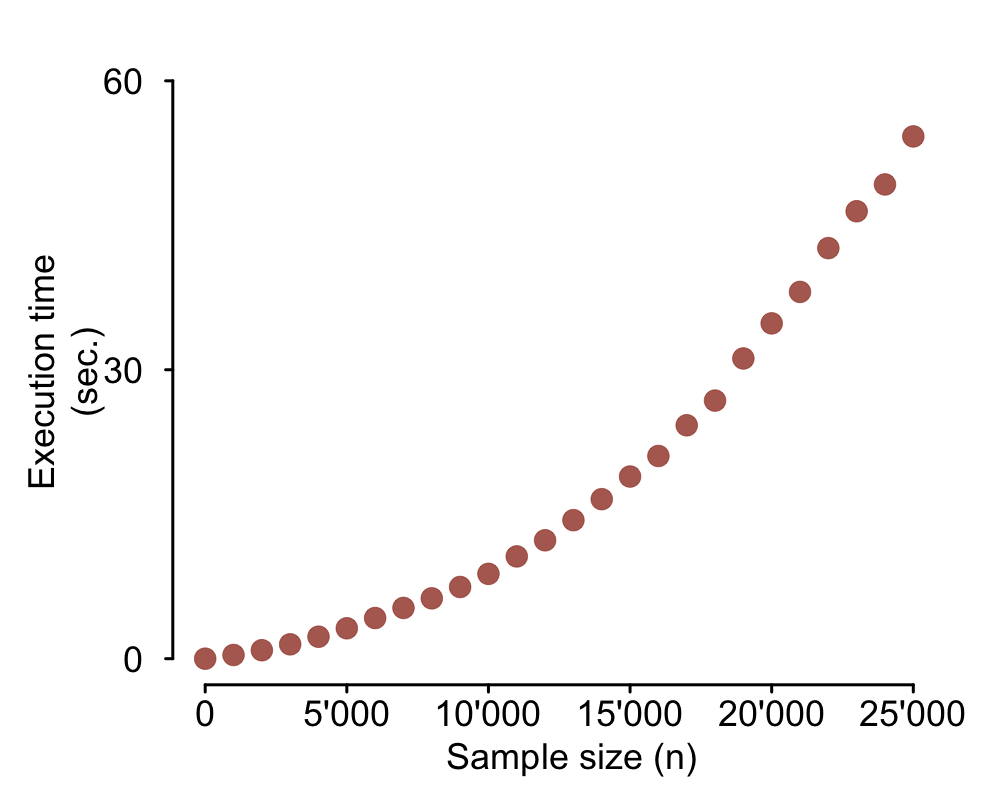
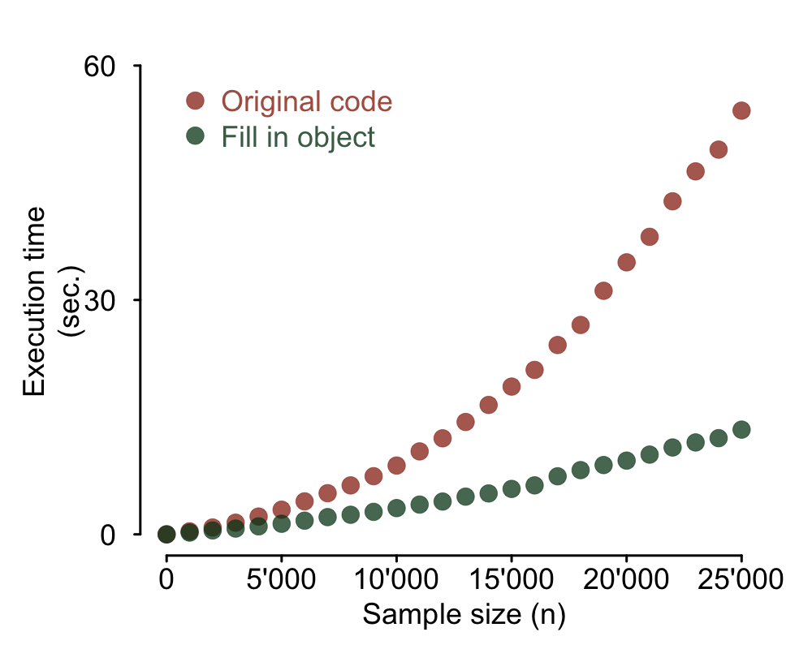

<h5> Full code on

</h5>

  

In his book [Advanced R](http://adv-r.had.co.nz/Performance.html), Hadley Wickham put it like this:

>R is not a fast language. This is not an accident. R was purposely designed to make data analysis and statistics easier for you to do. It was not designed to make life easier for your computer.

This is a fact, not an opinion. Execution time may be more or less important to you,
but with R speed comes second to providing an high level framework for easy data analysis.
That being said, there is no reason why you should not design your code to avoid
exceedingly long run times.

Some time ago, I "inherited" an R script at work that implemented a task I needed to
repeat and build on. As I started reading through it, I came across the following comment:

> Takes > 2 hours to complete! Run on HPC.

I couldn't see any reason why it should ever take that long. This article is about how
some minor changes brought execution time from two hours down to about five minutes.
This is not an exhaustive tutorial on strategies to speed up R code. It will rather
show you an example of simple rules that can go a long way making some specific code
run faster.

### The original slow code

In simple terms, the original script used as input a data frame containing several
million observations (rows) of a few variables. It looped through the rows and performed
an operation according to some condition. The result of the operation performed on all
observations in each row was added to a new data output frame as a new row. The
following is a highly simplified mock example illustrating the situation. It uses the
`sqrt` function as the mock operation on two variables (columns) and `rbind`
to store the result as a new row of the output data frame.


# The mock input data: data frame with large number of rows (n)
n <- 2000000
input <- as.data.frame(cbind(rnorm(n, mean = 100, sd = 1),
                             rnorm(n, mean = 100, sd = 1)))

# Initialize data frame to collect outputs
output <- as.data.frame(matrix(NA, nrow = 0, ncol = 2))

# Loop through all rows, perform operation and 'rbind' output
for(row in 1:nrow(input))) {
  # Loop through all columns and perform operation
  result <- sqrt(input[row, ])  # Some operation

  # Collect result by 'rbind'ing to output data frame
  output <- rbind(output, result)
}


The goal of the present analysis is to document the execution time of the original code
and illustrate the impact of some simple code optimization. If you want to do this kind
of analysis you should consider using something like the package *microbenchmark*.
*Microbenchmark* will run your piece of code many times and output summary statistics
of execution times. Here I will use a different approach. I will set up repeated runs of
the mock example above with increasing input data sizes and time each one of them to
document the increase in execution time. As you can see in the code below, I use the
function `system.time` to register the execution time of each run. The elapsed time
(in seconds) is then stored in a matrix together with the corresponding data size
(number of rows of the input data frame). Another option, similar to using `system.time`
but more convenient for longer pieces of code, would be to use the function `proc.time`.
A plot illustrating the results follows the code.


number_of_Ns <- 26 # Number of different sample sizes

# Matrix to collect execution time for each sample size
perform_slow <- matrix(NA, nrow = number_of_Ns, ncol = 2)
n <- 0

# Loop to run the task with all different sample sizes
for (iter in 1:number_of_Ns) {
  output_slow <- as.data.frame(matrix(NA, nrow = 0, ncol = 2))
  input <- as.data.frame(cbind(rnorm(n, mean = 100, sd = 1),
                               rnorm(n, mean = 100, sd = 1)))

  # Time execution of task for current iteration's data size
  time <- system.time(
    for(row in 1:nrow(input)) {
      result <- sqrt(input[row, ]) # Some operation (vectorized over columns)
      output_slow <- rbind(output_slow, result)
    }
  )
  cat(iter, ' - ', time[[3]], 'sec.\n') # Print message to track progress

  # Collect sample size (n) and respective execution time
  perform_slow[iter, 1] <- n
  perform_slow[iter, 2] <- time[[3]]

  # Increment sample size (n) for next iteration
  n <- n + 1000
}


### Code vectorization

R allows you to use code vectorization, as do many other programming languages. You
should never use a loop when you can vectorize the code. Vectorized code is more elegant,
easier to read, easier to debug and much faster to execute! The code should then be
optimized by replacing the nested `for loop` (the timed code above) by the vectorized
implementation:


output <- sqrt(input)


This is definitely what you would want to do in this situation. The problem here is
that in the real code represented by this mock example, the operation performed on each
row actually depended on the result of the operation on the preceding row. Because of
that, vectorization was unfortunately not an option. Read on to find out what else you
can do.

### Initialize output data frame at its final dimensions

A major speed bottleneck in this code is caused by the repeated use of `rbind`. The
function `rbind` is slow, particularly as the data frame gets bigger. You should
never use it in a loop. The right way to do it is to initialize the output object at
its final size right from the start and then simply fill it in with each turn of the loop.

Of course sometimes you do not know the final size of your output object in advance.
That was actually the case in my real situation too. Not all rows of the input data
resulted in an output and, for the ones that did, a variable number of new rows was
produced. I could however estimate the upper boundary for the output size: my output
data frame could have at most 10 times the number of rows of the input data. In that
case the solution is simply to initialize your data frame at its maximum possible value
and use the following code to dump empty rows at the end:


output <- output[complete.cases(output), ]


This mock example is not including that situation, though. It simply initializes the
output data frame at its exact final dimensions. Here's what the code looks like now
and the plot of the resulting execution speed.


# Matrix to collect execution time for each sample size
perform_fill_in <- matrix(NA, nrow = number_of_Ns, ncol = 2)
n <- 0

# Loop to run the task with all different sample sizes
for (iter in 1:number_of_Ns) {
    output_fill_in <- as.data.frame(matrix(NA, nrow = n, ncol = 2))
    input <- as.data.frame(cbind(rnorm(n, mean = 100, sd = 1),
                                 rnorm(n, mean = 100, sd = 1)))

    # Time execution of task for current iteration's sample size
    time <- system.time(
        for(row in 1:nrow(input)) {
            result <- sqrt(input[row, ])
            output_fill_in[row, ] <- result # Fill in data frame
        }
    )
    cat(iter, ' - ', time[[3]], 'sec.\n') # Print message to track progress

    # Collect sample size (n) and respective execution time
    perform_fill_in[iter, 1] <- n
    perform_fill_in[iter, 2] <- time[[3]]

    # Increment sample size (n) for next iteration
    n <- n + 1000
}


### _dplyr_ and `bind_rows`

It is often the case that you have no way of estimating the final size of the output
data frame. Do not despair, Hadley Wickham's package _dplyr_ comes to the rescue. If
you don't know _dplyr_, believe me when I tell you there's a lot it can do for you.
In this case I will use _dplyr_'s replacement for `rbind`, the function `bind_rows`.
We go back to initializing the output data frame with no rows and then adding the
result of each turn of the loop as a new row in the output data frame. But when you
now use `bind_rows` rather than `rbind` it runs much, much faster. Here's the code
and results plot.


library(dplyr)
# Matrix to collect execution time for each sample size
perform_dplyr <- matrix(NA, nrow = number_of_Ns, ncol = 2)
n <- 0

# Loop to run the task with all different sample sizes
for (iter in 1:number_of_Ns) {
  output_dplyr <- as.data.frame(matrix(NA, nrow = 0, ncol = 2))
  input <- as.data.frame(cbind(rnorm(n, mean = 100, sd = 1),
                               rnorm(n, mean = 100, sd = 1)))

  # Time execution of task for current iteration's sample size
  time <- system.time(
    for(row in 1:nrow(input)) {
      result <- sqrt(input[row, ])
      output_dplyr <- bind_rows(output_dplyr, result) # dplyr's bind_rows
    }
  )
  cat(iter, ' - ', time[[3]], 'sec.\n') # Print message to track progress

  # Collect sample size (n) and respective execution time
  perform_dplyr[iter, 1] <- n
  perform_dplyr[iter, 2] <- time[[3]]

  # Increment sample size (n) for next iteration
  n <- n + 1000
}


### What about the `apply` family?

The functions in the `apply` family are basically wrappers for `for loop`s. There
is a widespread misconception that they speed up code, but that is not true. The reason
for that seems to be historical, as this was apparently true in the early days of R
and in the S language. Nowadays, however, the `apply` functions are used because they
make code more readable (if you are familiar with them, that is; some people think
`for loop`s, being language agnostic, are easier to read). Using the `apply` functions
also helps prevent bugs, as it is easier to keep a nice and tidy function (and its use
with `apply`) than the code in the `for loop`. There are those who will swear that
in R `for loop`s are the root of all evil. Others will tell you they are so sick of
the `apply` snobs they will shoot the next person who dares even pronounce the word
`apply`. Don't be fooled. Ultimately, this is a matter of taste more than anything else.
Personally, I like them both.

### Conclusion

Keeping in mind some simple code optimization rules, such as the ones illustrated here,
is an easy way to cut execution times of many common tasks. For more complex situations,
there are nice tools you can use to diagnose speed bottlenecks in your code (I would
suggest RStudio's _profvis_ package). They can be extremely useful if your script
or program is more involved and complex.

You should definitely not spend hours optimizing code to save hours of a one off
script run. Your time is much more valuable than your computer's. There's no reason
not to learn a few ways to optimize your code, though. The added flexibility that
comes with the decrease in execution time will repeatedly save you time in your
future coding.

As a final note, let me just add that if you liked this article you will love the
[Performant code](http://adv-r.had.co.nz/Performance.html) section of Hadley Wicham's Advanced R book.
